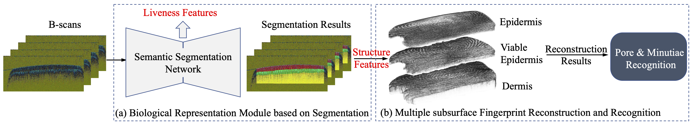

# A Uniform Representation Model for OCT-based Fingerprint Presentation Attack Detection and Reconstruction
This repository provides the official PyTorch implementation for the following paper:

**A Uniform Representation Model for OCT-based Fingerprint Presentation Attack Detection and Reconstruction** ([Paper](https://arxiv.org/pdf/2209.12208.pdf))

 > **Abstract:** *In current Optical Coherence Tomography (OCT) based fingerprint recognition systems, Presentation Attack Detection (PAD) and subsurface fingerprint reconstruction are treated as two independent branches, resulting in high computation and complexity of system building. This paper thus proposes a uniform representation model for PAD and subsurface fingerprint reconstruction simultaneously. A novel semantic segmentation network using attention mechanisms is designed to extract and segment multiple subsurface structures from real finger slices (i.e. B-scans). The latent codes derived from the network are directly used to effectively detect the PA since they contain abundant subsurface biological information, which is independent of PA materials and has strong robustness for unknown PAs. Meanwhile, the segmented subsurface structures are adopted to reconstruct multiple subsurface 2D fingerprints. Extensive experiments are carried out on an in-house database, which is the largest public OCT-based fingerprint database with 2449 volumes. PAD performance is evaluated by comparing the results of existing methods and other segmentation networks. The proposed uniform representation model can obtain an Accuracy(Acc) of 96.63%, which reaches state-of-the-art performance. The effectiveness of subsurface reconstruction is evaluated from the segmentation and recognition results. In segmentation experiments, the proposed method achieved the best results with an Intersection of Union (mIOU) of 0.834  and a Pixel Accuracy of 0.937. By comparing with the recognition performance on surface 2D fingerprints (e.g. commercial and high resolution), the lowest results with Equal Error Rate (EER) of 2.25%  by minutiae matching and EER of 5.42%  by pore matching are achieved, which indicates the excellent reconstruction capability of the proposed uniform representation model.*

